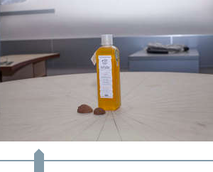

# Beauty Slider - just another jQuery plugin

This jQuery plugin was developed in 2012 for website of [White mandarin](http://whitemandarin.com) trademark to show 3d view of bottle from photo mask.



Of course, there is another slider plugin exists in jQuery UI, but using this solution:
- You don't need to include heavy jQuery UI library, because plugin is lightweight
- You can customize the view of slider easily with classes using
- You are able to add to page few sliders with different styles using different classes

You can take a look at the simple demo:

http://abagayev.github.io/jquery-beauty-slider

To start sliding include jQuery and Beauty Slider sources to your page:

```html
<script src="http://code.jquery.com/jquery-latest.min.js" type="text/javascript"></script>
<script src="http://abagayev.github.io/jquery-beauty-slider/plugin/jquery.slider.min.js" type="text/javascript"></script>
```

And init Beauty Slider with this code:

```javascript
$('#slider').beautyslider({
    // number of slide to start from, optional
    currentSlide:   1,
    // count of positions in slider, required
    slidesTotal:    7,
    // CSS class to add to slider, optional
    sliderCSS:      'beautyslider',
    // event to call when position is changed, required
    onChange: function () {
        $('#mario').css({
            'background-position': 300 * (1 - $(this).getCurrentSlide()) + 'px 0'
        })
    }
});
```

That's it!
